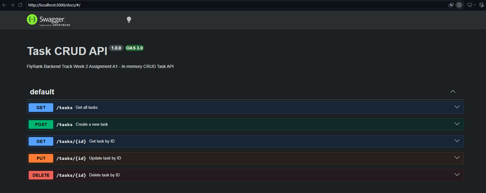

# FlyRank Backend Track - Week 2: CRUD Task API

A lightweight RESTful CRUD API built with Node.js and Express that manages an in-memory to-do list, fully documented with Swagger UI.

## Installation & Running

1. Clone repository:
\`\`\`bash
git clone <YOUR_PUBLIC_REPO_URL>
cd flyrank-be01-crud-api
\`\`\`

2. Install dependencies:
\`\`\`bash
npm install
\`\`\`

3. Start server (one documented command):
\`\`\`bash
npm start
\`\`\`
Server runs at \`http://localhost:3000\` and Swagger UI is accessible at \`http://localhost:3000/docs\`.

## Endpoints

| Method | Endpoint | Description | Status Codes |
|---|---|---|---|
| GET | `/` | API Overview & metadata | 200 |
| GET | `/health` | Health check endpoint | 200 |
| GET | `/tasks` | List all tasks | 200 |
| GET | `/tasks/:id` | Get single task by ID | 200, 404 |
| POST | `/tasks` | Create a new task | 201, 400 |
| PUT | `/tasks/:id` | Update task title and/or done status | 200, 400, 404 |
| DELETE | `/tasks/:id` | Remove a task | 204, 404 |

## Sample curl Output

\`\`\`bash
$ curl -i http://localhost:3000/tasks/1
HTTP/1.1 200 OK
X-Powered-By: Express
Content-Type: application/json; charset=utf-8
Content-Length: 76
ETag: W/"4c-c0K+Uu0aI/wX7c"
Date: Fri, 25 Sep 2026 13:40:00 GMT
Connection: keep-alive
Keep-Alive: timeout=5

{"id":1,"title":"Set up development environment","done":true}
\`\`\`

## Swagger UI Screenshot

## The Mortality Experiment (In-Memory Observation)
When tasks are created or modified, all changes exist exclusively in Node's volatile process heap. Restarting the server resets the state back to the original hardcoded seed list because no persistence layer (database or file) is attached. This demonstrates the fundamental need for persistent storage engines.